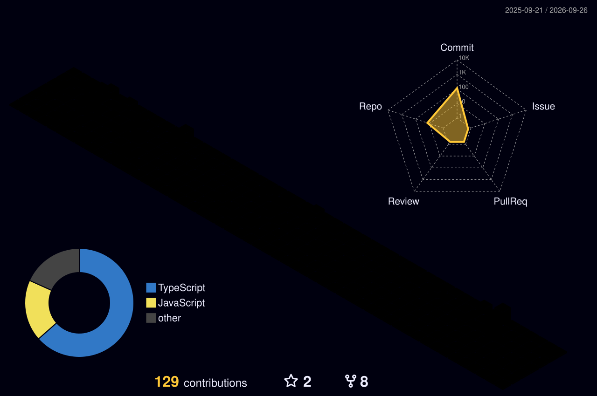

# G. JAYADITYA

 

  

  

 

## `CONTRIBUTION // MATRIX`

 

## `CONTRIBUTION // SNAKE`

 

## `ABOUT // JAY`

<table>
<tr>

<td width="50%" align="center">

### SOFTWARE

**Full-Stack Development**

React  
Next.js  
TypeScript  
Node.js  
REST APIs  
Databases

</td>

<td width="50%" align="center">

### BUILDING

**Product Engineering**

SaaS  
Interactive Interfaces  
Automation  
AI-powered Products  
Developer Tools  
Real-world Systems

</td>

</tr>
</table>

 

## `STACK // LOADED`

  

 

## `ROCKSPACE // ACTIVE`

  

 

## `ENGINEERING // ACTIVITY`

 

## `LANGUAGES // DISTRIBUTION`

 

## `ENGINEERING // TELEMETRY`

  

 

## `PROJECT // RADAR`

<table>
<tr>

<td align="center" width="50%">

</td>

<td align="center" width="50%">

</td>

</tr>
</table>

 

## `GITHUB // TROPHIES`

 

## `CURRENT // STATE`

  

 

## `TRANSMISSION // END`

  

  

