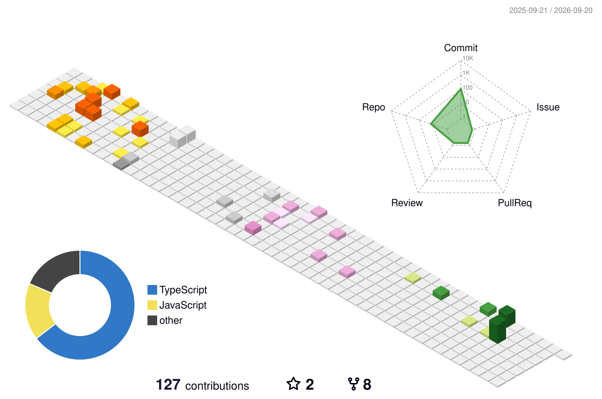

 

  

  

  

 

---

# `01 / WHO AM I`

 

  

I'm a software engineer who likes building things from scratch.

 

**Interfaces that feel alive.**

**Systems that actually work.**

**Products that solve real problems.**

 

I enjoy the entire process:

`IDEA` → `DESIGN` → `BUILD` → `BREAK` → `FIX` → `SHIP`

 

---

# `02 / THE CONTRIBUTION WORLD`

 

  

 

---

# `03 / THE SNAKE`

 

 

---

# `04 / CODE DNA`

 

  

 

---

# `05 / ENGINEERING TELEMETRY`

 

  

  

  

 

---

# `06 / THE STACK`

 

  

 

---

# `07 / ROCKSPACE`

 

  

  

### `PRODUCT → DEVELOPMENT → DEPLOYMENT`

 

RockSpace is where I build and experiment with real products,
interfaces and software systems.

 

**Design.**

**Engineering.**

**Deployment.**

**Iteration.**

 

---

# `08 / PROJECT RADAR`

 

<table>
<tr>

<td align="center" width="33%">

### `01`

### FRONTEND

React  
Next.js  
TypeScript  
Tailwind  
Three.js

</td>

<td align="center" width="33%">

### `02`

### BACKEND

Node.js  
Express  
PostgreSQL  
Supabase  
APIs

</td>

<td align="center" width="33%">

### `03`

### PRODUCT

UI / UX  
Prototyping  
Deployment  
Architecture  
Iteration

</td>

</tr>
</table>

 

---

# `09 / BUILD LOOP`

 

 

---

# `10 / CURRENT STATE`

 

  

 

---

# `11 / FIND ME`

 

&nbsp;&nbsp;

  

  

