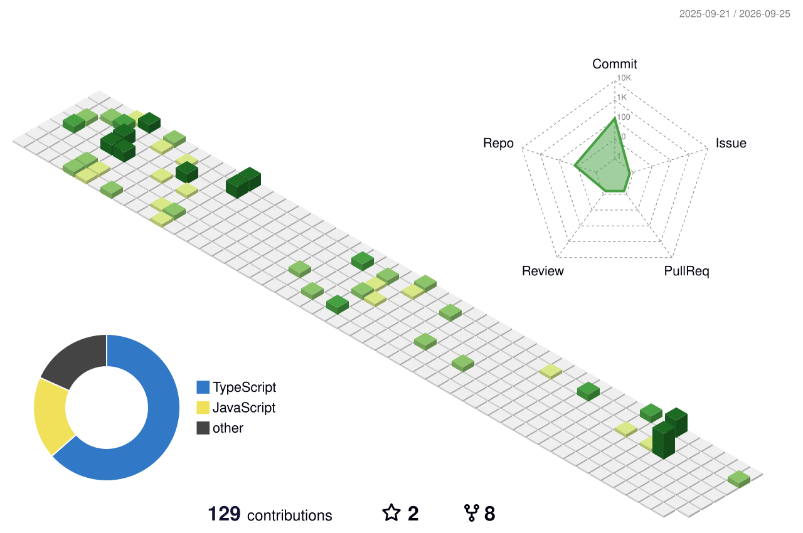

 

  

  

 

 

 

 

 

 

 

  

  

<table>
<tr>
<td align="center" width="25%">
 

  
<b>FRONTEND</b>
 
React / Next.js
 
TypeScript
 
Motion / 3D
  
</td>

<td align="center" width="25%">
 

  
<b>BACKEND</b>
 
Node.js
 
REST APIs
 
Databases
  
</td>

<td align="center" width="25%">
 

  
<b>AI / ENGINEERING</b>
 
Python
 
PyTorch
 
ML Systems
  
</td>

<td align="center" width="25%">
 

  
<b>SHIP</b>
 
Git
 
Docker
 
Vercel
  
</td>
</tr>
</table>

 

  

  

  

 

  

  

  

 

  

  

 

  

<table>
<tr>
<td align="center">

</td>

<td align="center">

</td>
</tr>
</table>

 

  

  

 

  

 

  

 

 

  

 

  

  

 

  

 

  

  

 

 

  

  

