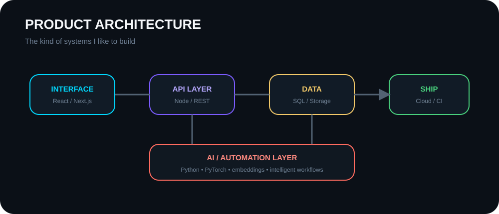
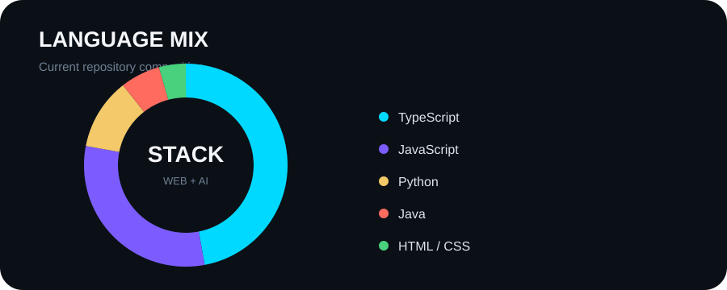
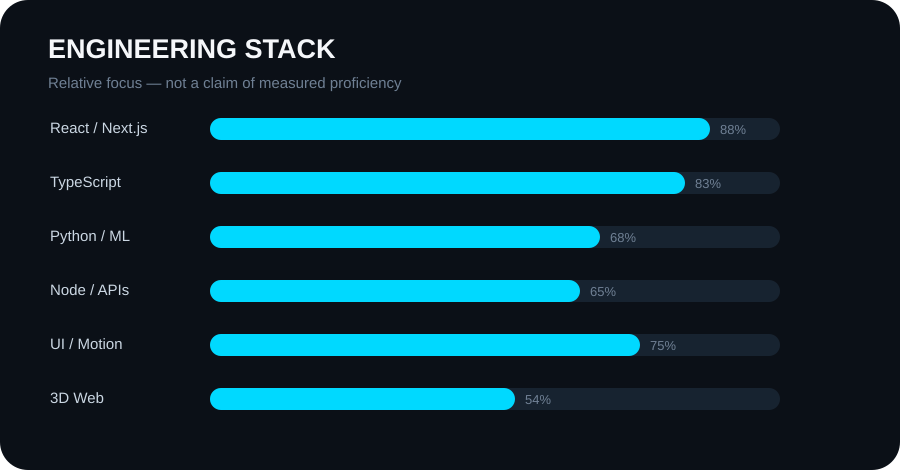
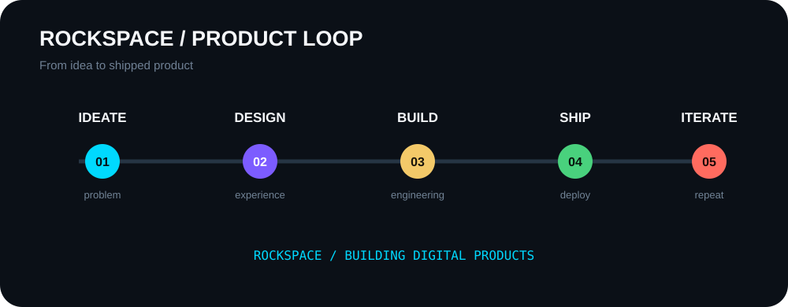
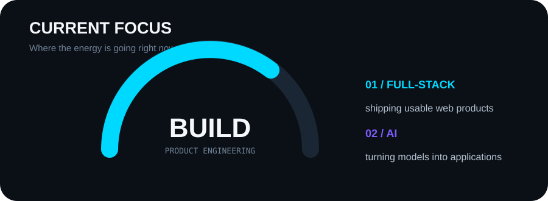
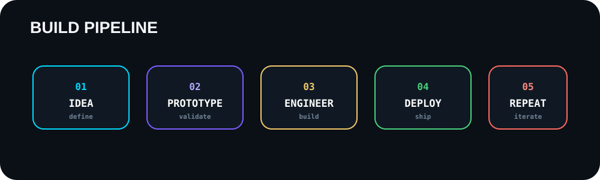

 

 

---

### `THE PROFILE IS A WORKBENCH, NOT A RESUME.`

## 🌌 GITHUB WORLD

<!-- Keep exactly ONE GitHub 3D contribution visual. -->

---

## 🧭 WHAT I BUILD

I like working across the whole product surface: interface, backend, data, deployment and the bits of automation that make the system feel alive.

---

## 📊 LANGUAGE MIX

---

## ⚙️ ENGINEERING STACK

---

## 🚀 ROCKSPACE

**RockSpace** is where I focus on turning ideas into actual digital products — from product thinking and interface design through engineering and deployment.

---

## 📡 BUILD RHYTHM

---

## 🎯 CURRENT FOCUS

---

## 🔁 HOW I BUILD

---

## 🐍 ONE SNAKE. THAT'S IT.

No snake wall. One is enough.

---

### `SHIP SOMETHING. THEN MAKE IT BETTER.`

 

  

