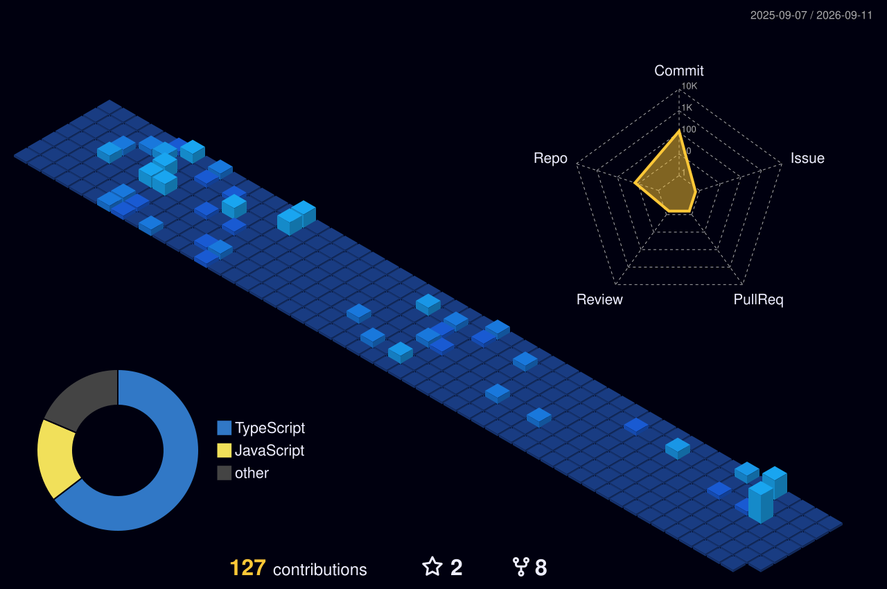
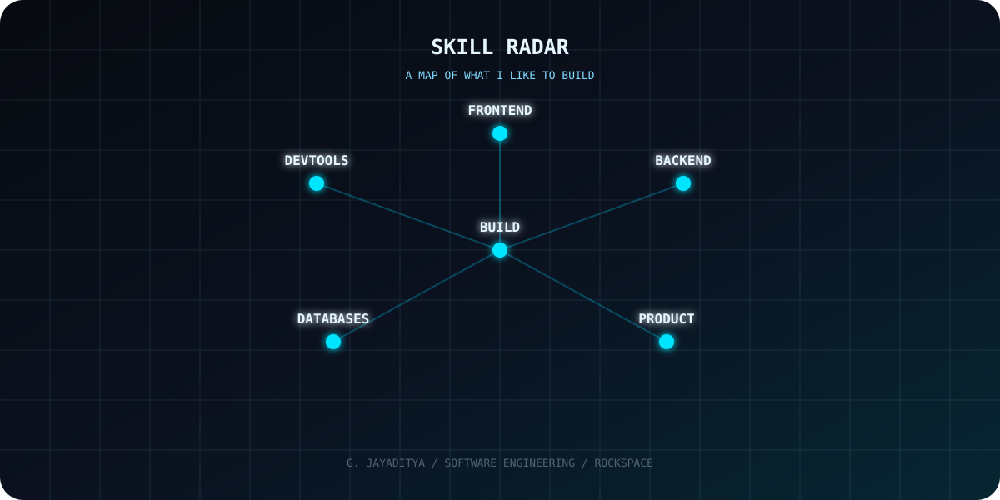
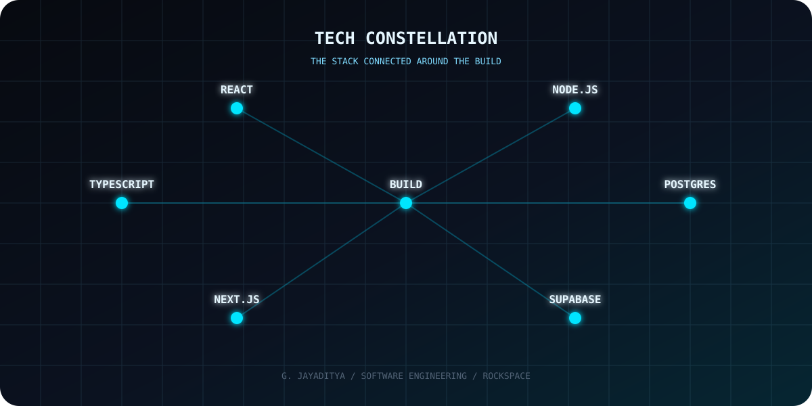
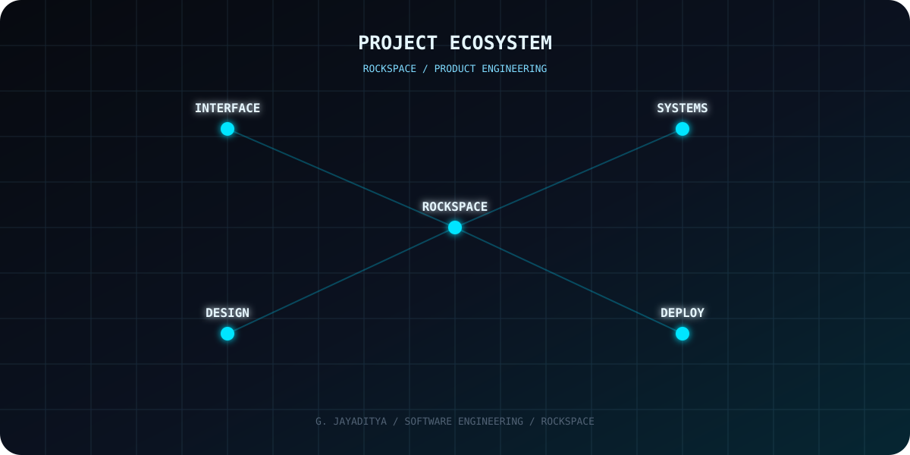
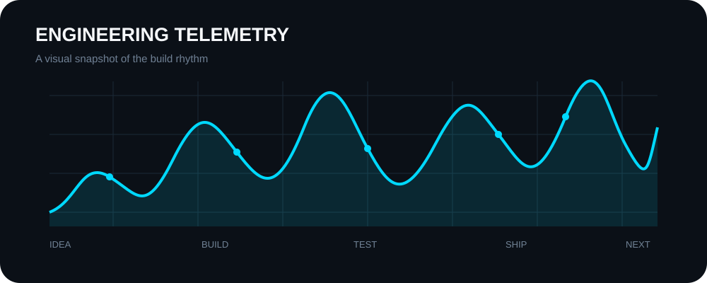

 

  

  

---

# `01 / THE ENGINEER`

  

I build software from **idea → interface → system → product**.

 

**Useful. Fast. Polished. Shippable.**

---

# `02 / CONTRIBUTION WORLD`

---

# `03 / SKILL RADAR`

---

# `04 / TECH CONSTELLATION`

---

# `05 / ROCKSPACE`

  

---

# `06 / CODE DNA`

  

---

# `07 / ENGINEERING TELEMETRY`

  

---

# `08 / THE STACK`

---

# `09 / BUILD LOOP`

---

# `10 / THE SNAKE`

---

# `11 / CURRENT STATE`

  

---

  

